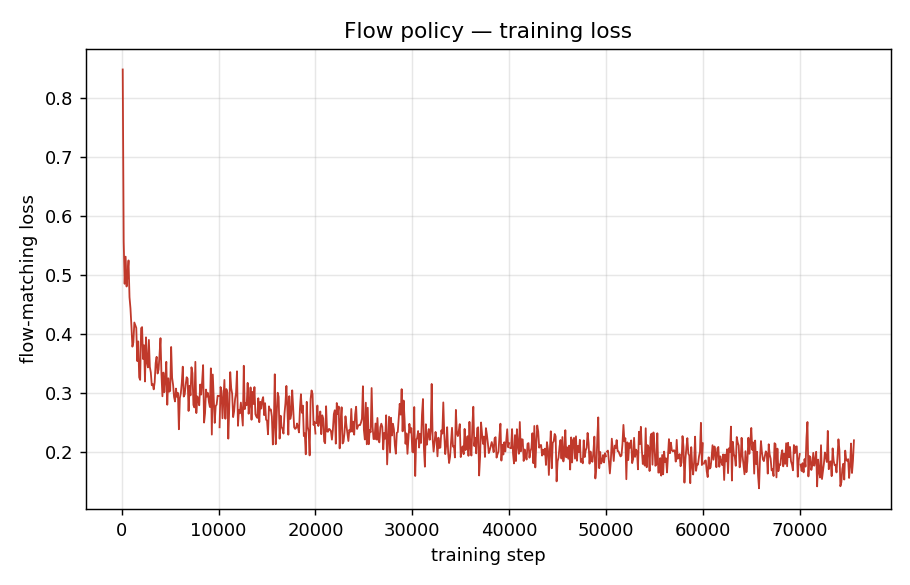
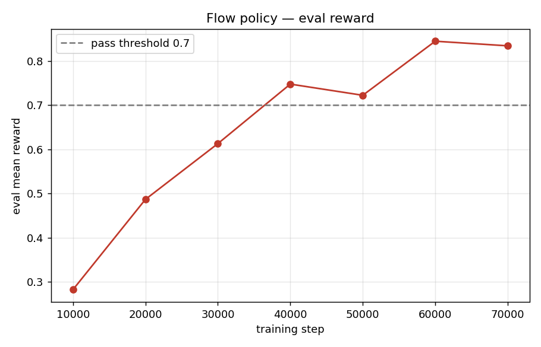
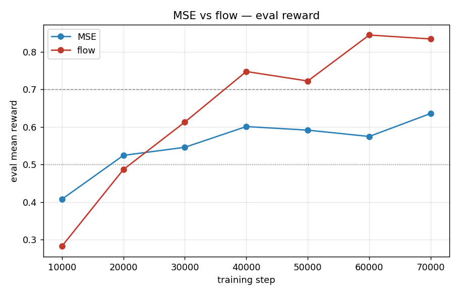
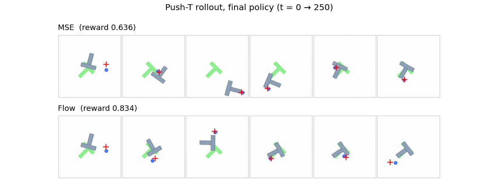

# HW1 — Part 3: Action Chunking with Flow Matching

## Result

The flow matching policy reaches a **best eval mean reward of 0.845** (at step 60k; final 0.834), clearing the required ≥ 0.7 threshold. It first crosses 0.7 by step 40k and stays above. The flow-matching loss falls from ≈0.9 (random init) and **plateaus around 0.22** — it does *not* approach zero, and that is expected (see note below).

| Metric | Value |
|---|---|
| Best eval mean reward | **0.845** (step 60,000) |
| Final eval mean reward | 0.834 |
| Final train loss | 0.220 |
| Training steps | 75,600 (400 epochs) |
| Inference Euler steps | 10 |
| Pass threshold | 0.7 ✅ |

**Why the loss plateaus above zero (unlike MSE):** the regression target is the velocity $A_t - A_{t,0}$, which is *stochastic* — for one noisy point $A_{t,\tau}$, many different (noise, data) pairs pass through it, each with a different target velocity. The network can only learn the *conditional mean* velocity, so an irreducible variance remains and the loss floors out well above zero. A low flow loss is therefore not the goal; the eval reward is.

## Network architecture

Same MLP backbone as the MSE policy, but the input is widened to carry the noisy chunk and the flow timestep, because the network represents a **velocity field** $v_\theta(o_t, A_{t,\tau}, \tau)$, not a one-shot map.

- **Input:** `state (5) + flattened noisy chunk (8×2=16) + τ (1)` = **22**
- **Hidden layers:** 3 × 256 units, **ReLU** after each
- **Output:** `chunk_size × action_dim = 16`, reshaped to `(8, 2)` — the predicted velocity; **no activation** (velocity is signed)
- **Pipeline:** `22 → 256 → 256 → 256 → 16`

| Hyperparameter | Value |
|---|---|
| Optimizer | Adam |
| Learning rate | 3e-4 |
| Weight decay | 0.0 |
| Batch size | 128 |
| Chunk size (K) | 8 |
| Epochs | 400 |
| Inference integration steps (n) | 10 |

**Training (hw1 eq. 2):** sample noise $A_{t,0}\sim\mathcal N(0,I)$ and $\tau\sim\mathcal U(0,1)$, interpolate $A_{t,\tau}=\tau A_t+(1-\tau)A_{t,0}$, and regress $v_\theta(o_t,A_{t,\tau},\tau)$ onto the straight-line velocity $A_t-A_{t,0}$ with an MSE loss.

**Inference (hw1 eq. 3):** start from noise and Euler-integrate $\frac{dA}{d\tau}=v_\theta$ from $\tau=0$ to $\tau=1$ in $n=10$ steps; the endpoint $A_{t,1}$ is the executed chunk.

## Training curves

*Loss from `exp/seed_42_20260604_132127/log.csv`; reward from the WandB run history (the `log.csv` header freezes on the first `loss`-only call, so `eval/mean_reward` is pulled from WandB).*

## MSE vs. flow

Flow tracks MSE early (both ≈0.4–0.5 at step 10–20k) but pulls decisively ahead after step 30k, ending ~0.21 reward higher (0.845 vs 0.636).

### Qualitative behavior (from the rollout videos)

Reading each row left→right as the episode advances ($t=0\to250$):

- **MSE** makes large, **tumbling** corrections — the one-shot chunk is the *average* of the expert's multimodal pushes, so the block frequently over-rotates and flings off-axis before being clawed back. It reaches the green target but tends to settle **rotationally misaligned**.
- **Flow** drives the block toward the silhouette **more decisively and with smoother agent motion** — sampling a fresh chunk from noise lets it commit to *one* coherent push instead of averaging several. On its best episodes it locks the T tightly onto the green.
- Both still show **residual end-of-episode drift** on the harder episodes (e.g. flow ep1 slides past the goal late). The flow advantage is not "never wobbles" — it is that the T is driven onto the target more cleanly and consistently, which is what lifts the *average* coverage by +0.21.

This matches the motivation in §3 of the assignment: MSE struggles with multimodal chunk distributions because it regresses to their mean, whereas flow matching samples from the distribution and so produces sharper, more committed actions.

## Rollout videos

35 eval rollout videos (5 episodes × 7 eval rounds), named `rollout_ep{0-4}_{step}_*.mp4` — higher `{step}` = more-trained policy.

📂 **[Open videos folder](../wandb/run-20260604_132128-bgjbk97s/files/media/videos/eval/)** (relative link)

Absolute path:
<file:///media/ajay/gdrive/_robo_thesis/repositories/robot-learning/04-imitation-learning/wandb/run-20260604_132128-bgjbk97s/files/media/videos/eval/>

WandB run (videos also viewable in browser): https://wandb.ai/ajaygunalan1995-johns-hopkins-university/hw1-imitation/runs/bgjbk97s
