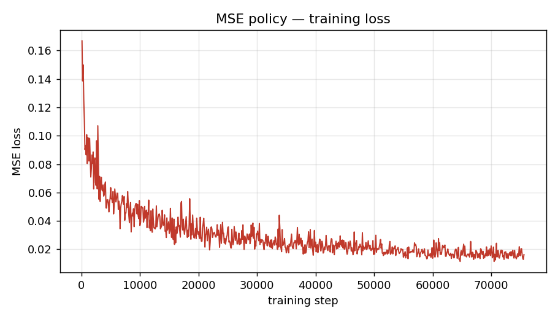
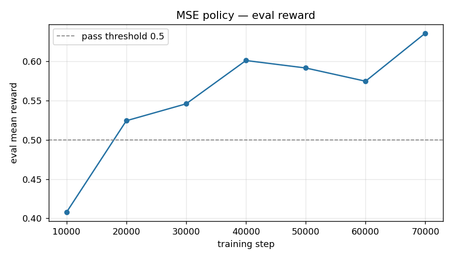

# Summary

| Part | Policy | Best eval reward | Threshold |
|---|---|---|---|
| 2 | MSE action chunking | **0.636** | 0.5 ✅ |
| 3 | Flow matching | **0.845** | 0.7 ✅ |

Both policies use the same 3×256 ReLU MLP backbone, chunk size $K=8$, Adam at lr $3\times10^{-4}$, batch 128, 400 epochs. The flow policy widens the input to carry the noisy chunk and flow timestep, and integrates a learned velocity field at inference.

---

# Part 2 — Action Chunking with MSE Loss

## Result

The MSE policy reaches a **best eval mean reward of 0.636** (final 0.636), clearing ≥ 0.5. Training loss falls from ≈1.0 to ≈0.016.

| Metric | Value |
|---|---|
| Best / final eval mean reward | **0.636** |
| Final train loss | 0.016 |
| Training steps | 75,600 (400 epochs) |

## Architecture

A plain MLP mapping one state to a flat action chunk, reshaped to $(K, \text{action\_dim})$.

- **Input:** `state_dim = 5` (agent $x,y$; T $x,y,\theta$)
- **Hidden:** 3 × 256, ReLU after each
- **Output:** $8\times2=16$, reshaped to $(8,2)$; no output activation (actions are raw coordinates)
- **Pipeline:** `5 → 256 → 256 → 256 → 16`

Loss: mean squared error between predicted and expert chunk (eq. 1).

## Training curves

---

# Part 3 — Action Chunking with Flow Matching

## Result

The flow policy reaches a **best eval mean reward of 0.845** (step 60k; final 0.834), clearing ≥ 0.7 — first crossing 0.7 by step 40k. The flow loss plateaus around **0.22**, not zero.

| Metric | Value |
|---|---|
| Best eval mean reward | **0.845** (step 60,000) |
| Final eval mean reward | 0.834 |
| Final train loss | 0.220 |
| Inference Euler steps $n$ | 10 |

**Why the loss floors above zero (unlike MSE):** the target velocity $A_t - A_{t,0}$ is stochastic — many (noise, data) pairs pass through one point $A_{t,\tau}$ with different velocities, so the net learns the conditional mean and an irreducible variance remains. Low flow loss is not the objective; eval reward is.

## Architecture

Same backbone, but the input carries the noisy chunk and timestep because the network is a **velocity field** $v_\theta(o_t, A_{t,\tau}, \tau)$, not a one-shot map.

- **Input:** `state (5) + flattened noisy chunk (16) + τ (1)` = **22**
- **Hidden:** 3 × 256, ReLU after each
- **Output:** 16 → $(8,2)$ predicted velocity; no output activation (velocity is signed)
- **Pipeline:** `22 → 256 → 256 → 256 → 16`

**Training (eq. 2):** sample $A_{t,0}\sim\mathcal N(0,I)$, $\tau\sim\mathcal U(0,1)$; interpolate $A_{t,\tau}=\tau A_t+(1-\tau)A_{t,0}$; regress $v_\theta$ onto $A_t-A_{t,0}$ with MSE.
**Inference (eq. 3):** start from noise, Euler-integrate $\frac{dA}{d\tau}=v_\theta$ from $\tau=0$ to $1$ in $n=10$ steps; $A_{t,1}$ is executed.

## Training curves

## MSE vs. flow

Flow tracks MSE early, then pulls ahead after step 30k, ending ~0.21 reward higher.

### Qualitative behavior (from rollout videos)

Reading each row left→right as the episode advances ($t=0\to250$):

- **MSE** makes large, **tumbling** corrections — the one-shot chunk is the *average* of the expert's multimodal pushes, so the block over-rotates and flings off-axis before being clawed back. It reaches the target but tends to settle **rotationally misaligned**.
- **Flow** drives the block toward the silhouette **more decisively, with smoother agent motion** — sampling a fresh chunk from noise lets it commit to one coherent push rather than averaging several. On its best episodes it locks the T tightly onto the green.
- Both retain **residual end-of-episode drift** on harder episodes (e.g. flow ep1 slides past the goal late). The flow advantage is not "never wobbles" — it is cleaner, more consistent driving onto the target, which lifts *average* coverage by +0.21.

This matches the §3 motivation: MSE regresses to the mean of a multimodal chunk distribution, whereas flow matching samples from it and so produces sharper, more committed actions.
